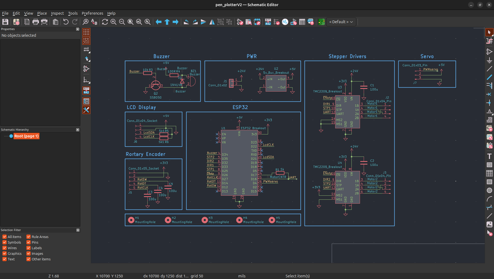
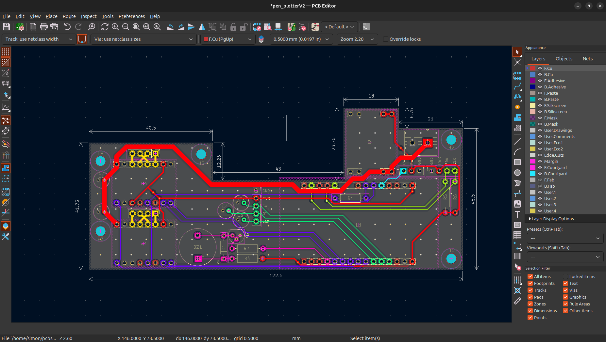
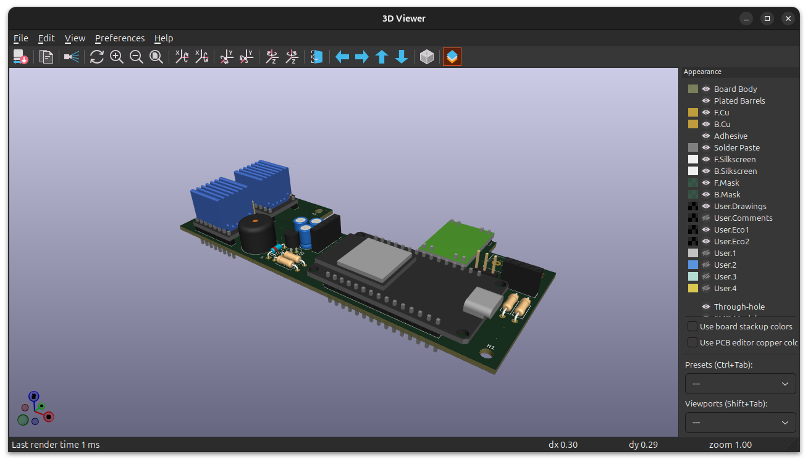

# Pen Plotter Controller Board

Eine selbst entworfene PCB-Steuerplatine für einen DIY Pen Plotter, entwickelt in KiCad. Die Platine steuert zwei Schrittmotoren für die XY-Bewegung, einen Servo für den Stifthub und übernimmt Benutzerführung sowie Energiemanagement vollständig auf einer einzigen Platine.

## Funktionen

- **ESP32** – Haupt-Mikrocontroller (Breakout aufgelötet) für Bewegungssteuerung und Logik
- **2× TMC2209** – Schrittmotortreiber (Breakouts aufgelötet) mit UART-Konfiguration, stealthChop und stallGuard
- **SG90 Servo** – Stift-Auf/Ab-Mechanismus
- **I2C LCD-Display** – Angeschlossen über Steckverbinder
- **Drehgeber** – Manuelle Steuerung und Menünavigation über Steckverbinder
- **Buzzer** – Akustisches Feedback
- **5V Buck Converter** – (Breakout aufgelötet) Erzeugt die interne 5V-Versorgungsschiene aus 24V
- **24V DC-Eingang** – Versorgung über externen Transformator (DC-Hohlbuchse)

## Stromversorgungsarchitektur

| Schiene | Quelle                          | Verbraucher                            |
|---------|---------------------------------|----------------------------------------|
| 24 V    | Externer Transformator (DC-Buchse) | TMC2209 Motorspannung               |
| 5 V     | Buck Converter Breakout         | ESP32, Servo, Buzzer, LCD              |
| 3,3 V   | Interner LDO des ESP32          | TMC2209 Logikspannung, Drehgeber       |

## Platinenübersicht

### Schaltplan

### PCB-Layout

### 3D-Ansicht

## Entwickelt mit

- [KiCad](https://www.kicad.org/) – Schaltplan und PCB-Layout